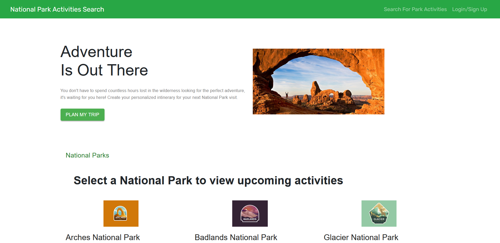

# park-planner

## About
This application enables users to organize the activities they would like to do at National Parks. 
The National Parks website was difficult to navigate, and so we created a simple way to view activities and save them for your trip.

## Description
The application uses the MERN stack with GraphQL to query and manipulate data. 
Users can create an account and login, select a park to view activities for that park, and then select which activities to save to a list. The user can then view a list of all of their saved activities.
If the user has already done an activity or changed their mind about it, they can remove it from their saved activities.
The parks and activities are pulled from a MongoDB database, and the user accounts and lists of saved activities are stored in that database.

## Usage
To use the application, navigate to the following link in your browser: https://limitless-caverns-87723.herokuapp.com/